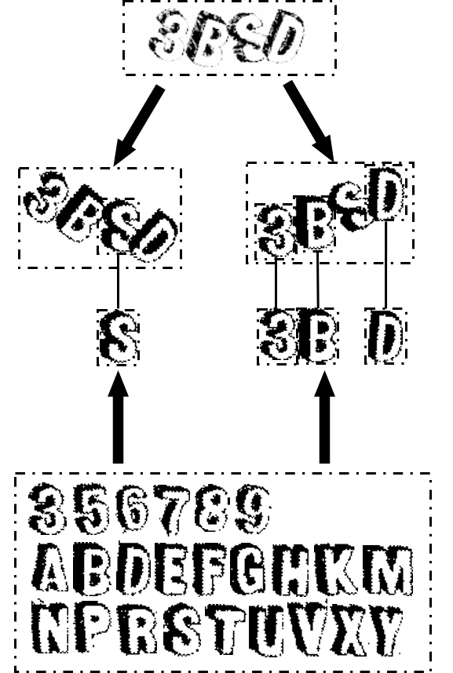

# Crack Zhihu Captcha

A tool to bypass captcha while scraping Zhihu.com.

## Demo


## Usage

```
from predict_captcha import predict

predict(img)
```

## Detail

<br>
<center>

</center>
<br>

This project uses travelsal to calculate the difference between each character in our [dictionary](/dictionary) and every sub block in the picture of captcha, and concludes in characters with top four smallest difference as our final answer.

<br>
<center>

</center>
<br>

### 2D Gaussian Distribution

It is very likely that characters or numbers in the captcha overlap with each other. A solution is to reduce the influence of those overlapping parts. Notice that most of times these parts locate at the margin of a character, so here I use 2D Gaussian Distribution as the weight to increase importance of center and decrease importance of margin.

<br>
<center>

</center>
<br>

### Hierarchical Clustering

The prediction is made by comparing the difference between characters in our dictionary and sub area on the captcha and then picking the smallest one. Hierarchical clustering is used in this project to limit such comparison in a specific region. 

<br>
<center>

</center>

<center>

</center>
<br>

A special case is shown below. If not using hierarchical clustering, the result will be "PUDG". If we use hierarchical clustering here, the "U" will not be chosen since it is not the optimal in its cluster and the "9" will be chosen instead.

## License
[MIT](https://choosealicense.com/licenses/mit/)